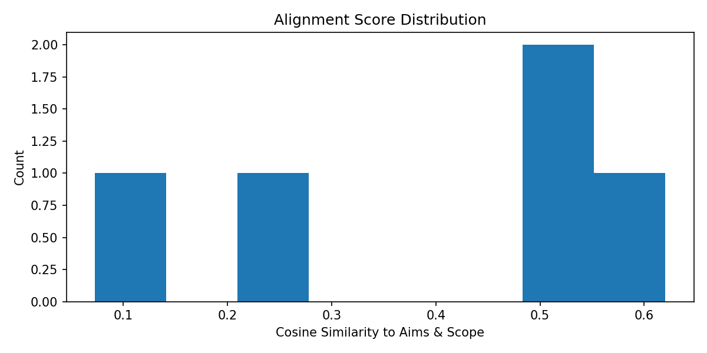
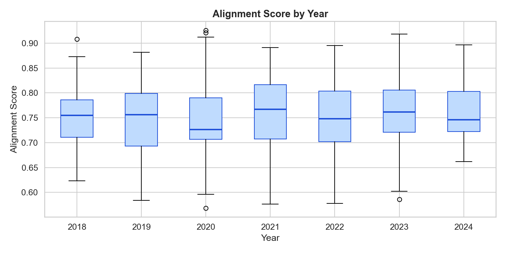
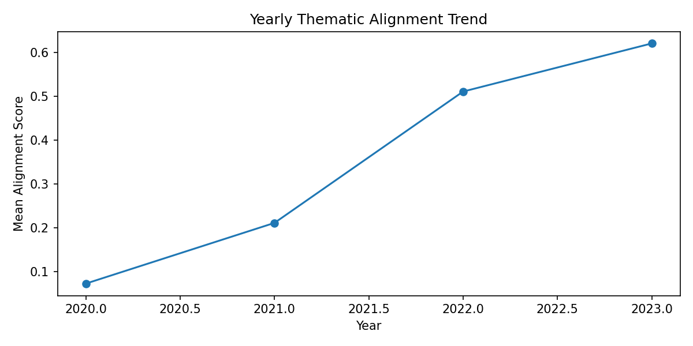
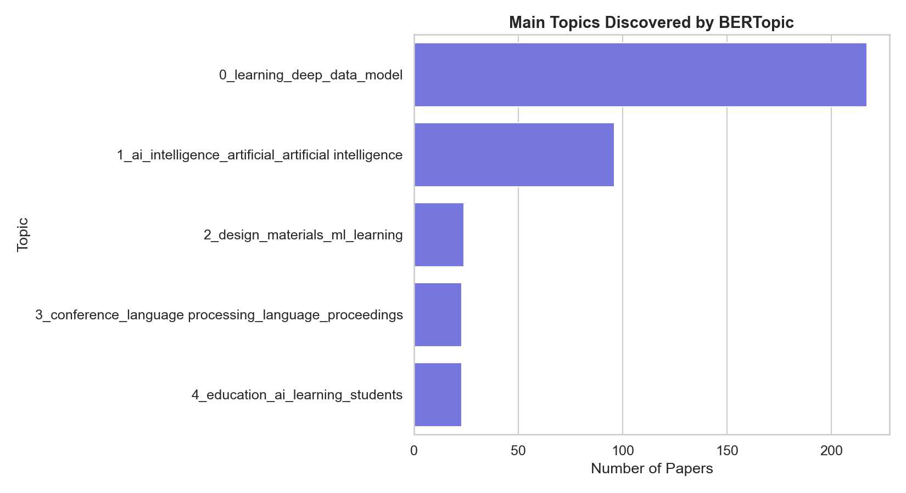

# Measuring Thematic Alignment Between Journal Scope and Published Articles Using NLP

**Author:** Elham Mirzaei Askarani
**Course:** Natural Language Processing

---

# 1. Introduction

Scientific journals define an **Aims & Scope** section to describe the research topics and scientific areas they aim to publish. However, as research fields evolve, the actual content of published papers may gradually change and become more specialized, interdisciplinary, or partially different from the original scope.

Manually evaluating whether hundreds of scientific papers remain aligned with a journal's scope is difficult and time-consuming. Natural Language Processing (NLP) techniques provide an automated way to analyze large collections of scientific documents and measure their semantic similarity.

This project investigates how NLP methods can be used to measure thematic alignment between a predefined journal scope and scientific article abstracts.

The main idea is to represent both the journal scope and paper abstracts as numerical semantic vectors and compare them using similarity measures.

The project focuses on three main goals:

* Quantifying the semantic alignment between scientific papers and the journal scope
* Detecting papers that significantly differ from the expected research theme
* Analyzing whether thematic alignment changes over time

To achieve this, the project combines transformer-based document embeddings, similarity analysis, statistical outlier detection, temporal analysis, and topic modeling.

---

# 2. Research Question & Methodology

## 2.1 Research Question

The main research question of this project is:

**Do scientific papers related to artificial intelligence and machine learning align with a predefined journal Aims & Scope, and does this alignment change over time?**

More specifically, the project aims to answer:

* How strongly do individual papers match the target research scope?
* Which papers behave as thematic outliers?
* Is there evidence of thematic drift across publication years?
* What major topics appear inside the collection of papers?

---

# 2.2 Dataset

Scientific paper metadata was collected using the OpenAlex API.

The dataset contains:

* 500 scientific papers
* Publication period: 2018–2024
* Paper title
* Abstract
* Publication year
* DOI information

The collected papers focus on areas related to:

* Artificial Intelligence
* Machine Learning
* Deep Learning
* Neural Networks
* Natural Language Processing
* Computer Vision

The abstracts were used as the main textual representation because they summarize the contribution and topic of each scientific paper.

---

# 2.3 System Architecture

The project follows a modular Object-Oriented Programming (OOP) structure.

The main components are:

* **PaperFetcher:** collects papers from OpenAlex API
* **DataLoader:** loads, validates, and preprocesses the dataset
* **ThematicEmbedder:** generates document embeddings
* **AlignmentAnalyzer:** computes similarity scores and performs analysis
* **AlignmentVisualizer:** creates plots and visual reports

This separation improves code readability, maintainability, and reproducibility.

---

# 2.4 Text Representation Using Scientific Embeddings

Traditional text comparison methods based only on keywords cannot fully capture semantic meaning.

Therefore, this project uses the transformer-based **SPECTER scientific document embedding model**.

The model converts:

* the journal Aims & Scope text
* each paper abstract

into dense numerical vectors that represent semantic meaning.

These embeddings allow comparison between texts even when they use different words but discuss similar concepts.

---

# 2.5 Alignment Measurement

After generating embeddings, cosine similarity is calculated between:

* the Aims & Scope embedding
* each paper embedding

The result is an alignment score.

Higher similarity scores indicate that a paper is more semantically related to the journal scope.

For each paper, the system calculates:

* alignment score
* alignment category (Low, Medium, High)
* z-score for outlier detection

Instead of manually defining thresholds, the project uses percentile-based classification:

* Low alignment: below Q25
* Medium alignment: between Q25 and Q75
* High alignment: above Q75

---

# 2.6 Outlier Detection

To identify papers with unusual thematic behavior, z-score analysis is applied.

Papers with:

z-score ≤ -1.5

are classified as low-alignment outliers.

These papers are not necessarily incorrect publications; they may represent interdisciplinary or specialized research topics.

---

# 2.7 Topic Modeling

In addition to similarity analysis, BERTopic is applied to discover hidden themes inside the collection of abstracts.

BERTopic combines transformer embeddings and clustering methods to automatically identify groups of papers discussing similar research topics.

This provides a deeper understanding of the thematic structure of the dataset.

---

# 3. Experimental Results

## 3.1 Dataset Overview

The final dataset contains:

| Metric                | Value     |
| --------------------- | --------- |
| Number of papers      | 500       |
| Year range            | 2018–2024 |
| NLP embedding model   | SPECTER   |
| Topic modeling method | BERTopic  |

---

# 3.2 Alignment Statistics

The analysis produced the following results:

| Metric                  | Value  |
| ----------------------- | ------ |
| Average alignment score | 0.7529 |
| Standard deviation      | 0.0675 |
| Maximum score           | 0.9258 |
| Minimum score           | 0.5683 |
| Low alignment papers    | 125    |
| Medium alignment papers | 250    |
| High alignment papers   | 125    |
| Detected outliers       | 34     |

The average score of approximately 0.75 indicates that most papers show strong semantic similarity with the defined research scope.

---

# 3.3 Alignment Distribution

The alignment score histogram shows the overall distribution of similarity values.

Most papers are concentrated around medium-to-high alignment scores, showing consistent thematic relevance.

The distribution also helps identify papers that significantly differ from the main research direction.

**Figure 1: Alignment Score Distribution**

Figure 1 shows the distribution of cosine similarity scores between paper abstracts and the Aims & Scope representation. Most papers are concentrated around the average alignment score of 0.7529, indicating strong thematic consistency across the dataset.

---

# 3.4 Outlier Analysis

A total of 34 low-alignment outliers were detected.

These papers had lower semantic similarity compared with the majority of the dataset.

The detected outliers generally represent:

* highly specialized applications
* interdisciplinary research
* topics that use AI methods in different scientific domains

**Figure 2: Alignment Score Distribution by Year**

Figure 2 presents the yearly distribution of alignment scores. The boxplots show score variability between years and highlight papers with lower alignment values compared with the majority of publications.

---

# 3.5 Temporal Drift Analysis

The yearly alignment analysis investigates whether papers become more or less aligned over time.

The estimated drift slope was:

**+0.002820 per year**

The positive slope indicates a slight improvement in thematic alignment from 2018 to 2024.

This suggests that recent publications are becoming slightly more focused around the defined AI research scope.

**Figure 3: Yearly Thematic Alignment Trend (2018–2024)**

Figure 3 shows the evolution of average alignment scores over time. The positive regression slope indicates a small but consistent increase in thematic alignment between 2018 and 2024.
---

# 3.6 Topic Modeling Results

BERTopic discovered multiple research themes inside the dataset.

Examples of discovered areas include:

* Artificial Intelligence
* Deep Learning
* Reinforcement Learning
* Natural Language Processing
* Graph-based learning methods
* AI applications in different domains

Topic modeling provides additional evidence about the conceptual structure of the publication collection.

**Figure 4: Topic Distribution Generated by BERTopic**

Figure 4 shows the main latent topics discovered automatically from paper abstracts. The dominant topics correspond to machine learning, deep learning, and artificial intelligence, while smaller topics represent specialized AI application areas.
---

# 4. Concluding Remarks

This project demonstrates that NLP techniques can effectively measure thematic alignment between scientific publications and a predefined research scope.

The combination of scientific document embeddings, cosine similarity, statistical analysis, and topic modeling provides a scalable approach for analyzing large scientific collections.

The results show:

* Strong overall thematic consistency
* A small number of low-alignment outliers
* A slight improvement in alignment over time
* Meaningful topic groups discovered automatically

## Limitations

Some limitations should be considered:

* The analysis depends on abstract text rather than full papers
* The Aims & Scope definition influences similarity scores
* Topic modeling quality depends on preprocessing choices

## Future Work

Possible improvements include:

* Increasing dataset size
* Comparing multiple journals
* Using full paper content
* Testing different scientific embedding models

---

# AI Assistance Statement

AI tools were used to support code organization, debugging, and documentation preparation.

All generated content, implementation decisions, results, and interpretations were reviewed and validated by the author.
